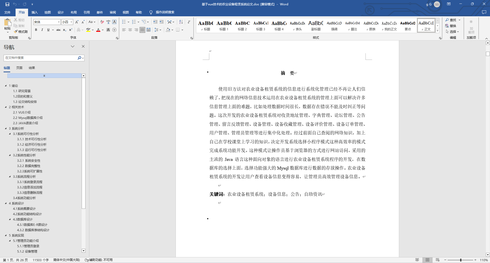
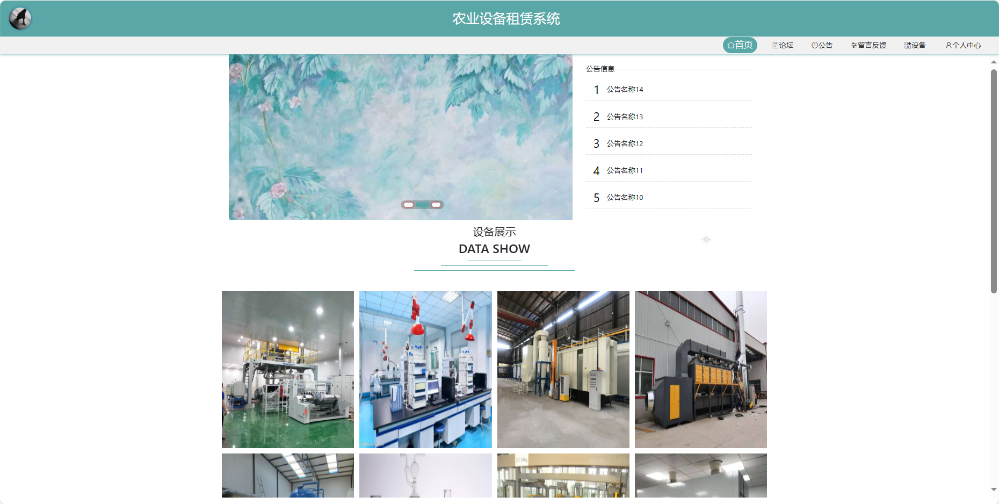
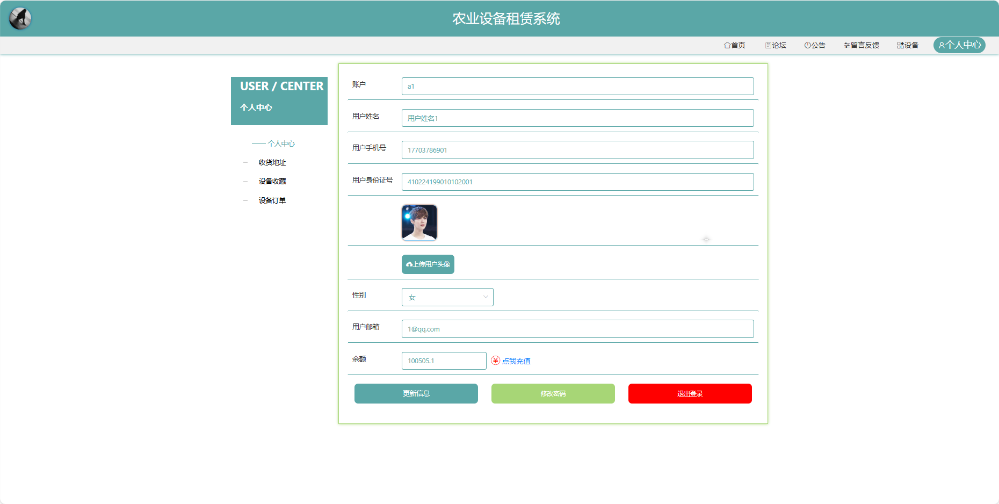

基于Springboot的农业设备租赁系统（程序+论文）
=
### 完整代码获取地址：从戎源码网 ([https://armycodes.com/](https://armycodes.com/))
### 作者微信：19941326836  QQ：952045282 
### 承接计算机毕业设计、Java毕业设计、Python毕业设计、深度学习、机器学习
### 选题+开题报告+任务书+程序定制+安装调试+论文+答辩ppt 一条龙服务
### 所有选题地址https://github.com/nature924/allProject

一、项目介绍
---
基于Spring Boot框架实现的农业设备租赁系统，系统包含两种角色：管理员、用户主要功能如下。

### 【用户功能】

首页：查看系统的基本信息。
论坛：参与用户间的交流和讨论。
公告：查看系统发布的相关通知和公告。
留言反馈：提供对系统或服务的反馈意见。
设备：浏览农业设备的租赁信息。
个人中心：管理个人信息、查看订单记录等。

### 【管理员功能】

首页：查看系统整体概况。
个人中心：管理个人信息。
管理员管理：管理系统的管理员账户。
基础数据管理：管理系统的基础数据。
论坛管理：监管和管理论坛的内容，。
公告管理：发布、编辑和删除系统公告。
留言反馈管理：查看和处理用户的留言反馈。
设备管理：管理农业设备的信息，设备上架、下架等。
用户管理：管理系统注册用户的信息。
轮播图信息：管理系统首页轮播图的内容和展示顺序。

二、项目技术
---
- 编程语言：Java
- 数据库：MySQL
- 项目管理工具：Maven
- 前端技术：VUE、HTML、Jquery、Bootstrap
- 后端技术：Spring、SpringMVC、MyBatis

三、运行环境
---
- 操作系统：Windows、macOS都可以
- JDK版本：JDK1.8以上都可以
- 开发工具：IDEA、Ecplise、Myecplise都可以
- 数据库: MySQL5.7以上都可以
- Tomcat：任意版本都可以
- Maven：任意版本都可以

四、运行截图
---
### 论文截图：

### 程序截图：

